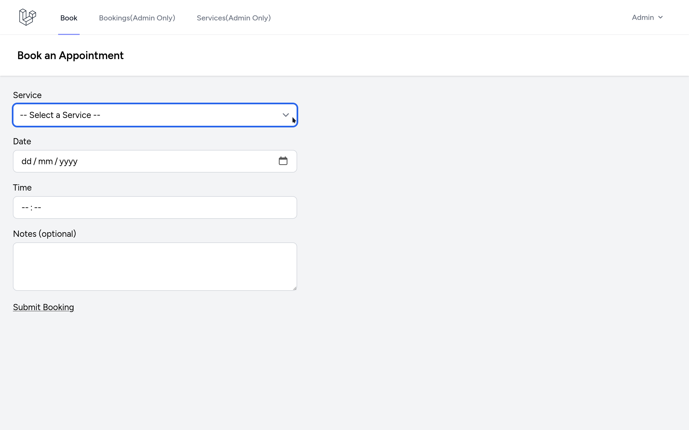
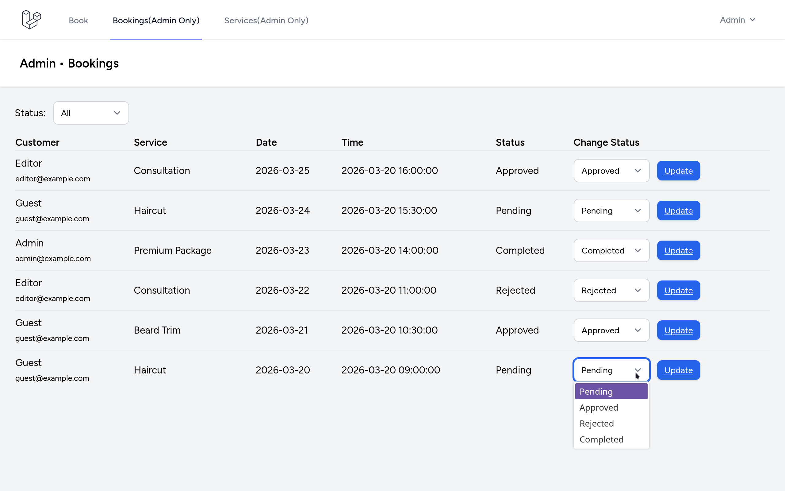
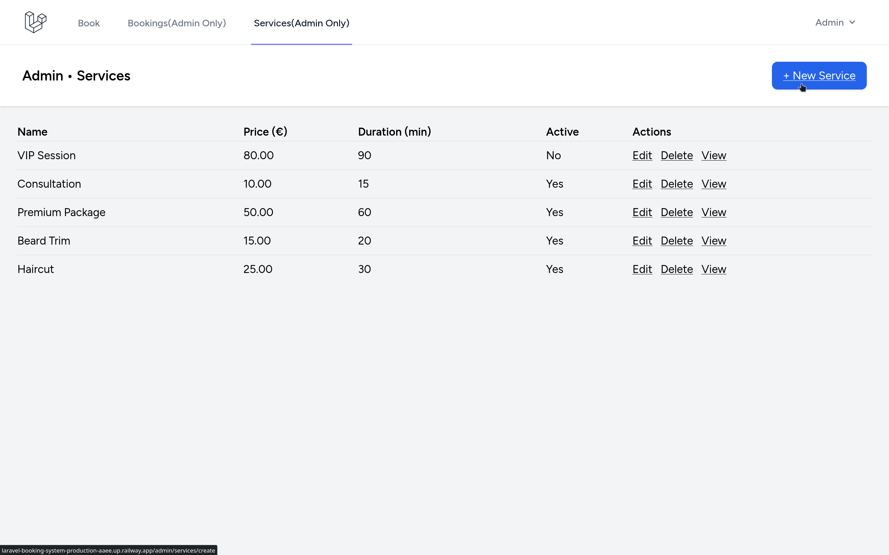

---

# 2. Laravel Appointment Booking System — polished GitHub README

```md
# Laravel Appointment Booking System


A booking management application built with Laravel.

Users can submit appointment requests, while administrators manage services and booking statuses through an admin dashboard.

## Live Demo

- Demo: `Coming soon`
- Admin: `Coming soon`

## Features

- Authentication
- Appointment booking form
- Services management
- Admin booking dashboard
- Booking status workflow
- Status filtering in admin panel
- Validation and friendly error messages
- Double-booking prevention
- Eloquent relationships between users, services, and bookings

## Screenshots

### Booking Form


### Admin Bookings Dashboard


### Services Management


## Tech Stack

**Backend**
- PHP
- Laravel

**Frontend**
- Blade
- Tailwind CSS

**Database**
- MySQL

**Tools**
- Git
- GitHub
- Linux
- Apache

## Installation

```bash
git clone https://github.com/yourusername/laravel-booking-system.git
cd laravel-booking-system
composer install
npm install
cp .env.example .env
php artisan key:generate